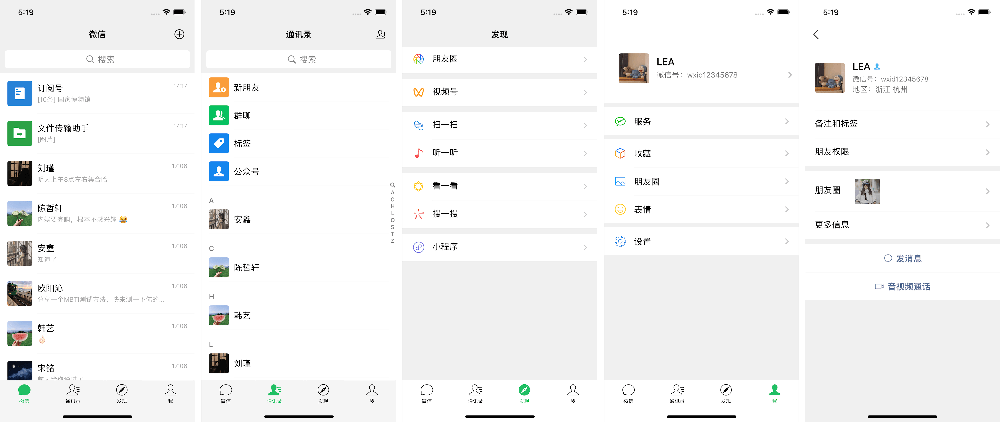
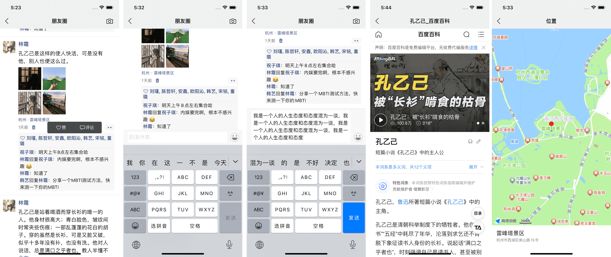

# MomentKit

实现WeChat朋友圈功能，代码整洁易读。里面的功能还没有全部完善，可根据自己的需求去补充一下，后面有时间我也会慢慢补充，欢迎[留言](https://github.com/ChaneyLau/MomentKit/issues)，互相学习。

## 使用说明

由于未上传`Pods`，请先安装`Pods`：

1. 打开`Terminal`，`cd`到文件夹下；
2. 执行`pod install`。

## 功能介绍

### 1、一级页面

1. 消息页面（模型：`Message`）；
2. 通讯录页面（包含索引，模型：`MUser`）；
3. 发现页面；
4. 我的页面；

PS：这些页面只是为了不让一级页面显得空，本控件主要是**朋友圈**功能的分享。

###  2、二级页面 > 朋友圈页面（主要功能）

1. 控制器（`Controller`）：朋友圈列表`MomentViewController`； 
2. 模型（`Model`）：`Moment`、`Comment`、`MPicture`； 
3. 视图（`View`）：

* 单个朋友圈动态视图（`MomentCell`）；
* 朋友圈图片区视图（`MMImageListView`）；
* 图片预览视图（`MMImagePreviewView`）；
* 赞|评论操作视图（`MMOperateMenuView`）等；

###  3、朋友圈的功能点

1. 支持富文本（`MLLinkLabel`）：链接、表情、电话、邮箱等；
2. 支持链接查看、电话拨打|拷贝、邮箱调取；
3. 支持位置查看（`高德地图`）；
4. 支持网络图片加载（`SDWebImage`）；
5. 支持图片预览：双击放大、双指捏合缩放、滚动预览等；
6. 支持数据库增删改查（`FMDB`+`JKDBModel`）；
7. 支持上拉加载更多（`MJRefresh`）； 
8. 支持点赞、取消点赞（`包含动效`）；
9. 支持评论、回复评论以及删除评论（`包含评论时滚动定位`）；
10. 支持文字长按拷贝（`UIMenuController`）；
11. 支持点击用户跳转详情；
12. 新增`Runloop`做流式页面流畅度优化(`图片加载`)；
13. 其他功能 > 未完待续；

## 效果图 

